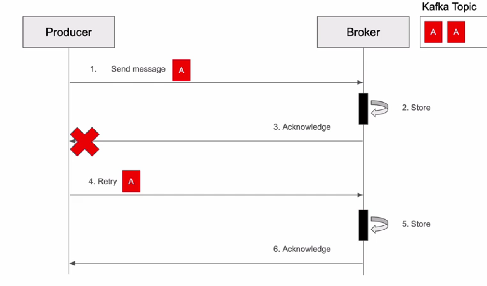
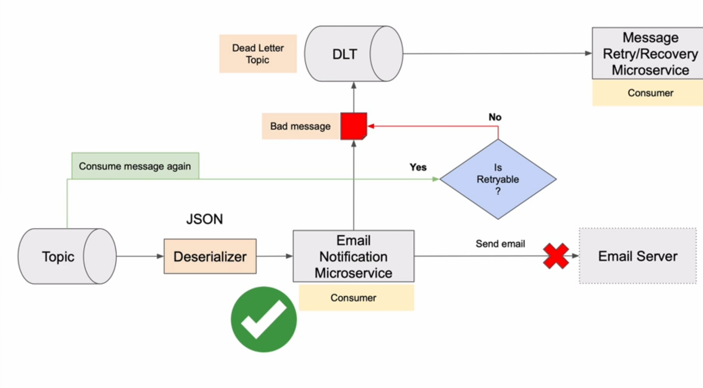

# Kafka
Learning Apache Kafka Integration with Spring Boot

## How run single server:
- Zookeper - deprecated
- KRaft:
  - broker.properties - contains config for the server that acts as a Broker , responsible for the storing and serving data for topic and partitions 
  - controller.properties - contains config for the server that acts as a controller, responsible cluster metadata and coordinate Leader 
  - server.properties - contains config for the server that acts as a Broker and Controller. Two in one
  - To start server run:
    - generate unique UUID for cluster: `./bin/kafka-storage.sh random-uuid` => oQ8vBd8ISt2PgzHY5Amzwg - use to config cluster
    - format log dir to use UUID and set config: `./bin/kafka-storage.sh format -t oQ8vBd8ISt2PgzHY5Amzwg -c config/kraft/server.properties`
    - run use config file: `./bin/kafka-server-start.sh config/kraft/server.properties`

## How run multiple servers:
- Create config in config/kraft/ for each server need to be created one file server.properties:
  - Update node.id properties in each file:
    - node.id=1, node.id=2, node.id=3 - if 3 servers will be created 
  - Update listeners properties for each file to diff ports: listeners=PLAINTEXT://localhost:9092,CONTROLLER://localhost:9093:
    - PLAINTEXT - is a Broker, CONTROLLER - is a Controller; Update each ports for each servers;
    - Example:
      - listeners=PLAINTEXT://localhost:9092,CONTROLLER://localhost:9093
      - listeners=PLAINTEXT://localhost:9094,CONTROLLER://localhost:9095
      - listeners=PLAINTEXT://localhost:9096,CONTROLLER://localhost:9097
  - Update controller.quorum.voters=1@locahost:9093 - use to specify a list of quorum voters in cluster
    - controller.quorum.voters=1@locahost:9093 : 1 is ID, host and port, can be IP adrr and domain name
    - This properties must be added to each conf files: controller.quorum.voters=1@localhost:9093,2@localhost:9095,3@localhost:9097
  - Update advertised.listeners:PLAINTEXT://localhost:9094:
    - Example:
      - advertised.listeners:PLAINTEXT://localhost:9092
      - advertised.listeners:PLAINTEXT://localhost:9094
      - advertised.listeners:PLAINTEXT://localhost:9096
  - Update log.dirs=/tmp/kraft-combined-logs to:
    - log.dirs=/tmp/server-1/kraft-combined-logs
    - log.dirs=/tmp/server-2/kraft-combined-logs
    - log.dirs=/tmp/server-3/kraft-combined-logs
- Prepare storage dir for cluster:
  - generate UUID for cluster from root kafka dir: `./bin/kafka-storage.sh random-uuid` => vW76WeX8QZSxrRMMEuQk3w
  - `./bin/kafka-storage.sh format -t vW76WeX8QZSxrRMMEuQk3w -c config/kraft/server-1.properties`
  - `./bin/kafka-storage.sh format -t vW76WeX8QZSxrRMMEuQk3w -c config/kraft/server-2.properties`
  - `./bin/kafka-storage.sh format -t vW76WeX8QZSxrRMMEuQk3w -c config/kraft/server-3.properties`
- Run servers:
  - `./bin/kafka-server-start.sh config/kraft/server-1.properties`
  - `./bin/kafka-server-start.sh config/kraft/server-2.properties`
  - `./bin/kafka-server-start.sh config/kraft/server-3.properties`

## How stop properly Producers and Consumers before server:
- To avoid loosing messages and not produce errors
- Better way to stop server using CLI script: `kafka-server-stop.sh`

- 

- **Broker** - instance of Apache Kafka. Allow horizontal scaling - few Brokers sync between each other. All topics sync between brokers;
- **Topic** - place where Producer push messages and Consumer read messages;
- **Partition** - Part of Topic. A division in the topic for load balancing and parallel processing;


## Message
**Message** consist of:
- Key (bytes):
  - String
  - JSON
  - Avro
  - null
- Event (bytes):
    - String
    - JSON
    - Avro
    - null
- Timestamp
- Headers - additional metadata info can be added

## Topic
- Producer add(publish) events to topic and consumer read(subscribe) events from. Can read in parallel from different partitions
- You can increase number of partitions but can not reduce!
- New event always added to the end
- Event immutable - you can't change or update event. ONLY Add new event!
- Event are in order in one partition but not ordered across partition
- Default retention time is 7 days - can be changed by config
- In what partition event be send kafka itself will decide - if message key not provider
- No guarantee order of reading event if message key not providing - and it is a problem if order required
- Adding message key, kafka will use it to store event to some partition in order how added:


## Broker
- It is a kafka server. One of them is a Leader others is Follower (replica of leader). The role can be change dynamically.
- All Event in-sync on replica in the same order.
- If Leader down, one of the Follower stay Leader.

- Each Broker can be Leader and Follower at the same time for different partition. Example:


## Kafka Topic CLI
- Allow to interact with topics: `kafka-topics.sh`:
  - Create
  - List
  - Describe
  - Delete
  - Modify
- To Create:
  - `./bin/kafka-topics.sh --create --topic unique-topic-name --partitions 3 --replication-factor 3 --bootstrap-server localhost:9092,localhost:9094,localhost:9096`
  - --topic unique-topic-name - should be unique meaningful name
  - number of partitions should be greater than number of consumers
  - --replication-factor - how many copies store in other followers - **not be greater than number of servers in cluster**
  - --bootstrap-server localhost:9092 where provide list of kafka brokers in cluster
- To List: `./bin/kafka-topics.sh --list --bootstrap-server localhost:9092`
  - --bootstrap-server localhost:9092 - list for this server
- To get more info about topics:
  - ./bin/kafka-topics.sh --describe --bootstrap-server localhost:9092
  - 
- To delete topic with name unique-topic-name2:
  - ./bin/kafka-topics.sh --delete --topic unique-topic-name2 --bootstrap-server localhost:9092
  - if config property `delete.topic.enable=true` you can delete topic

## Console Producer
- Use `kafka-console-producer.sh` to produce event
  - Send message:
    - `./bin/kafka-console-producer.sh --bootstrap-server localhost:9092,localhost:9094 --topic unique-topic-name` and type message
    - if topic no exist and config `auto.create.topics.enabled=true` - kafka create topic at the moment of sending message with default config
    - best practice create a topic before sending messages
  - Send as a key-value pare:
    - `./bin/kafka-console-producer.sh --bootstrap-server localhost:9092,localhost:9094 --topic unique-topic-name --property "parse.key=true" --property "key.separator=:"`
    - > your-key:your-custom-message

## Console Consumer
- Use `kafka-console-consumer.sh` to read topic - A Kafka consumer can indeed be configured to consume messages from multiple topics. This allows for greater flexibility and efficient utilization of consumers, especially when dealing with a variety of topics that require similar processing logic.
  - Read message:
    - `./bin/kafka-console-consumer.sh --bootstrap-server localhost:9092 --topic unique-topic-name --from-beginning` that show all messages from topic from begin
    - `--bootstrap-server localhost:9092` specify a list of brokers
    - `./bin/kafka-console-consumer.sh --bootstrap-server localhost:9092 --topic unique-topic-name` read and wait for the new messages only
  - Read key-value pairs:
    - Consumer display only value `./bin/kafka-console-consumer.sh --bootstrap-server localhost:9092 --topic unique-topic-name`
    - Consumer display key-value `./bin/kafka-console-consumer.sh --bootstrap-server localhost:9092 --topic unique-topic-name --property "print.key=true"`
    - Consumer display only key `./bin/kafka-console-consumer.sh --bootstrap-server localhost:9092 --topic unique-topic-name --property "print.key=true" --property "print.value=false"`

## Configure Producer to wait for acknowledgement that event was delivered to topic:
- set properties:
```
spring:
  kafka:
    producer:
      acks: all # wait acknowledgement from all Brocker - slower
      OR
      acks: 1 # wait acknowledgement from 1 Leader Brocker - a litle bit aster that all
      OR
      acks: 0 # not wait at all - very fast
```
-  --config min.insynck.replicas=3 - means will wait ack from min 3 Brockers;
- Speed of waiting depends on from number of replicas


```
spring:
  kafka:
    producer:
      retries: 10 # How many times will try to send. Default value is 2147483647
      properties:
        retry.backoff.ms: 1000 # how long will wait before retry. Default value is 100ms
        delivery.timeout.ms: 120000 # Max time Producer can spend trying to deliver the message - better to use this one. Default 120000ms Kafka doc recomends use this properties instead of [retries and retry.backoff.ms]
        # Rule: delivery.timeout.ms >= request.timeout.ms + linger.ms
        request.timeout.ms: 30000 # The max time that Producer will wait and buffer data before sending a batch a message. Default value = 0
        linger.ms: 0 # The max time to wait for a response from Broker after sending request. Default value = 30000ms
```

## Update existing topic --config min.insync.replicas:
- `./bin/kafka-configs.sh --bootstrap-server localhost:9092 --alter --entity-type topics --entity-name unique-topic-name --add-config min.insync.replicas=2`


## Idempotent Producer - avoid duplicate message in the log in the presence of failure and retries
```
spring:
  kafka:
    producer:
        enable.idempotence: true
```
- `enable.idempotence=true` - in new version this is default value
- But this config can turn off default idempotence:
- 
- OR turn on through code:
```
@Bean
...
config.put(ProducerConfig.ENABLE_IDEMPOTANCE_CONFIG, true);
```
- Avoid retry send message if ack lost during communication issues:
- Example issue img: 
- Example solution: 
- Config collision example: 
### NOTE!
- `acks: not all` and `enable.idempotence: true` - Will produce ConfigurationException
- `with value of retries less than 1` and `enable.idempotence: true` - Will produce ConfigurationException
- `max.in.flight.requests.per.connection: greter than 5` and `enable.idempotence: true` - Will produce ConfigurationException

## Dead Letter Topic (DLT)
- Send messages to this topic if deserialization error occurs
- Consumer send messages to DLT:
  - Retryable exception handling: 


## Consumer group
- If multiple instances consumers, one message will handle only ONCE!
- You can't run more consumers that the number of partitions on the topic! If instances more that partitions - this instance will IDLE and nothing do
- 
- Config:
```
@KafkaListener(topics = KafkaProducerConfig.EVENTS_TOPIC, groupId = "product-created-events")
```
in .yml OR in @Configuration
```
config.put(ConsumerConfig.GROUP_ID_CONFIG, "product-created-events");
OR
spring:
  kafka:
    consumer:
      group-id: product-created-events
```

## Idempotent Consumer
- Handle message only once - even if this message will produce multiple times
- Avoiding Duplicate Messages techniques (Better solution is combine techniques):
  - Idempotent Consumer
  - Idempotent Producer
  - Transactions
- Error example: 

- Idempotent Consumer solution example:
- Assign message id to each message, and write this ID to DB


## Transactions
- Allow to write to multiple topic atomically
  - Producer config from .yml:
```
spring:
  kafka:
    producer:
      transfer-id-prefix: some-custom-prefix-${random.value}- # number of id kafka add to the end of this prefix
logging:
  level:
   org.springframework.kafak: TRACE
   transaction: TRACE
```
OR
  - Producer config from @Bean configuration:
```
...
@Value("${spring.kafka.producer.transaction-id-prefix}")
private String transactionalIdPrefix;
...
public Map<String, Object> producerConfigs() {
...
props.put(ProducerConfig.TRANSACTIONAL_ID_CONFIG, transactionalIdPrefix);
}
...
@Bean
KafkaTransactionManager<String, Object> kafkaTransactionManager(ProducerFactory<String, Object> producerFactory) {
	return new KafkaTransactionManager<>(producerFactory);
}
	
```
- Rollback for specific exception:
  - By default rollback work only Unchecked exceptions only
  - To Add exception to handle rollback:
```
@Transactional(value = "kafkaTransactionManager", 
    rollbackFor = {TransferServiceException.class, ConnectException.class})
```
  - To skip exception and no rollback even this exception take place:
```
@Transactional(value = "kafkaTransactionManager",
    rollbackFor = {TransferServiceException.class, ConnectException.class},
    noRollbackFor = CustomNoRollbackException.class)
    ...
```

- Config for Consumer to consume ONLY commited events in topic:
- config in .yml:
```
spring:
  kafka:
    consumer:
      isolation-level: READ_COMMITTED
```
- OR from code:
```
@Bean
	ConsumerFactory<String, Object> consumerFactory() {
	...
	config.put(ConsumerConfig.ISOLATION_LEVEL_CONFIG, 
				environment.getProperty("spring.kafka.consumer.isolation-level", "READ_COMMITED").toLowerCase());
	}
```

## Local Transactions
- Send multiple messages in one transaction:
```
kafkaTemplate.executeInTransaction(t -> {
...
t.send("topic-1", event1);
callRemoteServer();
t.send(topic-2", event2);
...
}
```
- With this solution Transaction only inside lambda `t -> {}` will work:


## How run Kafka with Docker:
```
version: "3.8"

services:
  kafka-1:
    image: bitnami/kafka:latest
    ports:
      - "9092:9092"
    environment:
      - KAFKA_CFG_NODE_ID=1 # each brocker must have unique ID
      - KAFKA_KRAFT_CLUSTER_ID=WnLkTHhkQaiJbwP8FClPhw # must be unique for entire cluster, all brockers that works in cluster must have the same cluster ID. for generation you can use `./kafka-storage.sh random-uuid` from terminal
      - KAFKA_CFG_PROCESS_ROLES=controller,broker # define roles for this kafak server (broker) 
      - KAFKA_CFG_CONTROLLER_QUORUM_VOTERS=1@kafka-1:9091 # usualy this is few brockers in the same cluster
      - KAFKA_CFG_LISTENERS=PLAINTEXT://:9090,CONTROLLER://:9091,EXTERNAL://:9092 # define available listeners: PLAINTEXT - for inter brocker communication with each other - unencrypted , CONTROLLER - internal coordination (metadata between brockers), EXTERNAL - external network listener allow extrernal client (outside of docker container) to connect to kafka brocker - port must be the same as in ports:
      - KAFKA_CFG_ADVERTISED_LISTENERS=PLAINTEXT://kafka-1:9090,EXTERNAL://${HOSTNAME:-localhost}:9092 # PLAINTEXT - internal, brocker to brocker communication, EXTERNAL - to external listeners.
      - KAFKA_CFG_LISTENER_SECURITY_PROTOCOL_MAP=CONTROLLER:PLAINTEXT,EXTERNAL:PLAINTEXT,PLAINTEXT:PLAINTEXT # mapping between listeners name. Each listener use that security protocol; [CONTROLLER:PLAINTEXT] means CONTROLLER listener use PLAINTEXT security protocol; PLAINTEXT - means no encryption - ONLY for development. For PROD must be used SSL, example: EXTERNAL:SSL
      - KAFKA_CFG_CONTROLLER_LISTENER_NAMES=CONTROLLER # custom name for listener
      - KAFKA_CFG_INTER_BROKER_LISTENER_NAME=PLAINTEXT # custom name for listener for inter-brocker communication
    volumes: # for save data on the host machine
      - /home/trofimov/kafka/docker-compose/volumes/:/bitnami/kafka
```
- Add to env var
```
HOSTNAME=host.docker.internal  
```

- To run docker-compose with env file: `docker-compose -f docker-compose.yml --env-file environment.env up`
- How execute CLI command: `docker exec -it [container-ID OR name]  bahs` to enter to docker image
- `/opt/bitnami/kafak/bin` - dir where all .sh located and you can run it here.
- OR `docekr-compose exec [NAME-Of-CONTAINER] opt/bitnami/kafak/bin/kafka-topics.sh --list --bootstrap-server host.docker.internal:9092`
- OR go home dir for kafka on local machine: `kafka-topics.sh --list --bootstrap-server localhost:9092`, to work this you need modify `/etc/hosts` on local machine and add
```
127.0.0.1 host.docker.internal
```

## How run multiple Kafka from one docker-compose:
```
version: "3.8"

services:
  kafka-1:
    image: bitnami/kafka:latest
    ports:
      - "9092:9092"
    environment:
      - KAFKA_CFG_NODE_ID=1
      - KAFKA_KRAFT_CLUSTER_ID=WnLkTHhkQaiJbwP8FClPhw
      - KAFKA_CFG_PROCESS_ROLES=controller,broker
      - KAFKA_CFG_CONTROLLER_QUORUM_VOTERS=1@kafka-1:9091,2@kafka-2:9091,3@kafka-3:9091
      - KAFKA_CFG_LISTENERS=PLAINTEXT://:9090,CONTROLLER://:9091,EXTERNAL://:9092
      - KAFKA_CFG_ADVERTISED_LISTENERS=PLAINTEXT://kafka-1:9090,EXTERNAL://${HOSTNAME:-localhost}:9092
      - KAFKA_CFG_LISTENER_SECURITY_PROTOCOL_MAP=CONTROLLER:PLAINTEXT,EXTERNAL:PLAINTEXT,PLAINTEXT:PLAINTEXT
      - KAFKA_CFG_CONTROLLER_LISTENER_NAMES=CONTROLLER
      - KAFKA_CFG_INTER_BROKER_LISTENER_NAME=PLAINTEXT
    volumes:
      - /home/trofimov/kafka/docker-compose/volumes/server-1:/bitnami/kafka

  kafka-2:
    image: bitnami/kafka:latest
    ports:
      - "9094:9094"
    environment:
      - KAFKA_CFG_NODE_ID=2
      - KAFKA_KRAFT_CLUSTER_ID=WnLkTHhkQaiJbwP8FClPhw
      - KAFKA_CFG_PROCESS_ROLES=controller,broker
      - KAFKA_CFG_CONTROLLER_QUORUM_VOTERS=1@kafka-1:9091,2@kafka-2:9091,3@kafka-3:9091
      - KAFKA_CFG_LISTENERS=PLAINTEXT://:9090,CONTROLLER://:9091,EXTERNAL://:9094
      - KAFKA_CFG_ADVERTISED_LISTENERS=PLAINTEXT://kafka-2:9090,EXTERNAL://${HOSTNAME:-localhost}:9094
      - KAFKA_CFG_LISTENER_SECURITY_PROTOCOL_MAP=CONTROLLER:PLAINTEXT,EXTERNAL:PLAINTEXT,PLAINTEXT:PLAINTEXT
      - KAFKA_CFG_CONTROLLER_LISTENER_NAMES=CONTROLLER
      - KAFKA_CFG_INTER_BROKER_LISTENER_NAME=PLAINTEXT
    volumes:
      - /home/trofimov/kafka/docker-compose/volumes/server-2:/bitnami/kafka

  kafka-3:
    image: bitnami/kafka:latest
    ports:
      - "9096:9096"
    environment:
      - KAFKA_CFG_NODE_ID=3
      - KAFKA_KRAFT_CLUSTER_ID=WnLkTHhkQaiJbwP8FClPhw
      - KAFKA_CFG_PROCESS_ROLES=controller,broker
      - KAFKA_CFG_CONTROLLER_QUORUM_VOTERS=1@kafka-1:9091,2@kafka-2:9091,3@kafka-3:9091
      - KAFKA_CFG_LISTENERS=PLAINTEXT://:9090,CONTROLLER://:9091,EXTERNAL://:9096
      - KAFKA_CFG_ADVERTISED_LISTENERS=PLAINTEXT://kafka-3:9090,EXTERNAL://${HOSTNAME:-localhost}:9096
      - KAFKA_CFG_LISTENER_SECURITY_PROTOCOL_MAP=CONTROLLER:PLAINTEXT,EXTERNAL:PLAINTEXT,PLAINTEXT:PLAINTEXT
      - KAFKA_CFG_CONTROLLER_LISTENER_NAMES=CONTROLLER
      - KAFKA_CFG_INTER_BROKER_LISTENER_NAME=PLAINTEXT
    volumes:
      - /home/trofimov/kafka/docker-compose/volumes/server-3:/bitnami/kafka
```